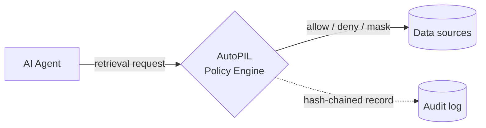

<Callout kind="tip">
  **Govern the context. Trust the agent.™** AutoPIL sits between your agents and their data — evaluating every retrieval request against policy *before* information ever enters the context window.
</Callout>

## Start here

<Columns cols="2">
  <Card title="Quick start" href="/getting-started/quickstart" icon="zap" horizontal="false">
    Install the SDK, point it at a policy directory, and protect your first retrieval in minutes.
  </Card>

  <Card title="API reference" href="/api-reference/authentication" icon="code" horizontal="false">
    Authenticate and call the REST API to evaluate context, manage policies, and query audit logs.
  </Card>
</Columns>

## How it works

Data catalogs govern data *upstream*. Output filters govern responses *downstream*. AutoPIL governs the layer in between — the context an agent is allowed to retrieve.



## Get started in three steps

<Steps>
  <Step title="Install" icon="download">
    Add the AutoPIL package to your project and set your environment variables.

    ```bash
    pip install autopil
    ```
  </Step>

  <Step title="Bootstrap the engine" icon="power">
    Initialize AutoPIL, point it at a policy directory, and confirm enforcement is live.

    See [First-start bootstrap](/getting-started/first-start) for the full walkthrough.
  </Step>

  <Step title="Protect a retrieval" icon="shield">
    Wrap any retrieval function with a single decorator — every call is now evaluated against policy.

    ```python
    @guard.protect()
    def fetch_customer_records(query: str):
        ...
    ```
  </Step>
</Steps>

## Core concepts

<Columns cols="2">
  <Card title="Architecture" href="/core-concepts/architecture" icon="network" horizontal="false">
    How the governance layer sits between your agents and their data sources.
  </Card>

  <Card title="Enforcement flow" href="/core-concepts/enforcement-flow" icon="git-branch" horizontal="false">
    Trace a retrieval request from policy evaluation to allow, deny, or mask.
  </Card>

  <Card title="Multi-tenancy" href="/core-concepts/multi-tenancy" icon="building" horizontal="false">
    Row-level tenant isolation across policies, sessions, and audit records.
  </Card>

  <Card title="Agent identity" href="/core-concepts/agent-identity" icon="fingerprint" horizontal="false">
    Bind every request to a verified agent so decisions are attributable.
  </Card>
</Columns>

## Policies & integration

<Columns cols="2">
  <Card title="Policy file format" href="/policy-guide/policy-format" icon="file-code" horizontal="false">
    Write YAML policies with source allowlists, denylists, and sensitivity ceilings.
  </Card>

  <Card title="Fields reference" href="/policy-guide/fields-reference" icon="list" horizontal="false">
    Every policy field, its accepted values, and how it is evaluated.
  </Card>

  <Card title="Python SDK" href="/sdks/python-sdk" icon="code" horizontal="false">
    Guard retrieval functions with decorators and middleware in your Python stack.
  </Card>

  <Card title="MCP Server" href="/sdks/mcp-server" icon="server" horizontal="false">
    Expose governance as MCP tools for agents that speak the Model Context Protocol.
  </Card>
</Columns>

## API reference

<Columns cols="2">
  <Card title="Authentication" href="/api-reference/authentication" icon="lock" horizontal="false">
    Provision API keys and authenticate requests to the governance API.
  </Card>

  <Card title="Evaluate context" href="/api-reference/context/evaluate-context" icon="scale" horizontal="false">
    Submit a retrieval request and get an allow, deny, or mask decision back.
  </Card>

  <Card title="Policies" href="/api-reference/policies/list-policies" icon="shield" horizontal="false">
    List, create, version, and hot-reload the policies that drive enforcement.
  </Card>

  <Card title="Audit log" href="/api-reference/audit/list-audit-events" icon="scroll-text" horizontal="false">
    Query the tamper-evident, hash-chained record of every governance decision.
  </Card>
</Columns>

## Deploy & operate

<Columns cols="2">
  <Card title="Docker" href="/deployment/docker" icon="container" horizontal="false">
    Run AutoPIL as a container in staging or production.
  </Card>

  <Card title="Postgres" href="/deployment/postgres" icon="database" horizontal="false">
    Back the audit log and policy store with a durable Postgres instance.
  </Card>

  <Card title="OpenTelemetry" href="/deployment/opentelemetry" icon="activity" horizontal="false">
    Route metrics and traces to Datadog, Grafana, or Splunk.
  </Card>

  <Card title="PII masking" href="/deployment/pii-masking" icon="eye-off" horizontal="false">
    Redact sensitive fields before they ever reach an agent's context.
  </Card>
</Columns>
