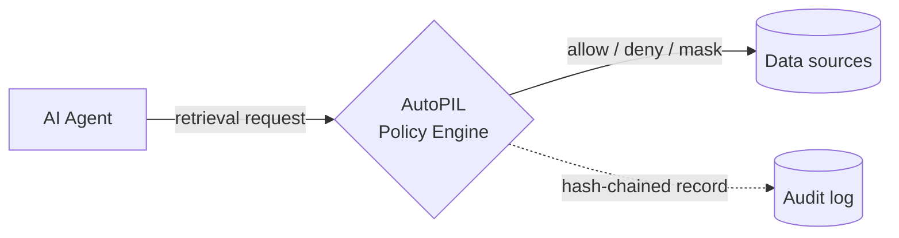

## AutoPIL Documentation

Govern the context. Trust the agent.™ AutoPIL enforces data-access policy at retrieval time — before sensitive data enters an agent's context window — and records every decision in a tamper-evident audit trail. Start with a quickstart, explore the concepts, or jump straight into the API.

<Columns cols="3">
  <Card title="Quick start" href="/getting-started/quickstart" icon="zap" horizontal="false">
    Protect your first retrieval in minutes.
  </Card>

  <Card title="API reference" href="/api-reference/authentication" icon="code" horizontal="false">
    Authenticate and call the governance API.
  </Card>

  <Card title="Start free trial" href="https://www.autopil.ai/" icon="rocket" horizontal="false">
    Evaluate AutoPIL for your enterprise.
  </Card>
</Columns>

## Protect your first retrieval

Wrap any retrieval function with a single decorator. Every call is now evaluated against policy before data is returned.

```python title="app.py"
from autopil import guard

@guard.protect()
def fetch_customer_records(query: str):
    # Retrieval runs only if policy allows it —
    # otherwise the request is denied or sensitive fields are masked.
    return db.search(query)
```

Follow the [Quick start](/getting-started/quickstart) for installation, policy setup, and first-run bootstrap.

## How AutoPIL works

Data catalogs govern data *upstream*. Output filters govern responses *downstream*. AutoPIL governs the layer in between — the context an agent is allowed to retrieve — and writes an immutable record of every decision.



## Core concepts

<Columns cols="2">
  <Card title="Architecture" href="/core-concepts/architecture" icon="network" horizontal="false">
    How the governance layer sits between your agents and their data sources.
  </Card>

  <Card title="Enforcement flow" href="/core-concepts/enforcement-flow" icon="git-branch" horizontal="false">
    Trace a retrieval request from policy evaluation to allow, deny, or mask.
  </Card>

  <Card title="Multi-tenancy" href="/core-concepts/multi-tenancy" icon="building" horizontal="false">
    Row-level tenant isolation across policies, sessions, and audit records.
  </Card>

  <Card title="Agent identity" href="/core-concepts/agent-identity" icon="fingerprint" horizontal="false">
    Bind every request to a verified agent so decisions are attributable.
  </Card>
</Columns>

## Policies & integration

<Columns cols="2">
  <Card title="Policy file format" href="/policy-guide/policy-format" icon="file-code" horizontal="false">
    Write YAML policies with source allowlists, denylists, and sensitivity ceilings.
  </Card>

  <Card title="Fields reference" href="/policy-guide/fields-reference" icon="list" horizontal="false">
    Every policy field, its accepted values, and how it is evaluated.
  </Card>

  <Card title="Evaluation order" href="/policy-guide/evaluation-order" icon="list-ordered" horizontal="false">
    Understand precedence when multiple rules match a request.
  </Card>

  <Card title="Sensitivity levels" href="/policy-guide/sensitivity-levels" icon="gauge" horizontal="false">
    Set ceilings that cap what an agent can ever retrieve.
  </Card>
</Columns>

## API reference

<Columns cols="2">
  <Card title="Authentication" href="/api-reference/authentication" icon="lock" horizontal="false">
    Provision API keys and authenticate requests to the governance API.
  </Card>

  <Card title="Evaluate context" href="/api-reference/context/evaluate-context" icon="scale" horizontal="false">
    Submit a retrieval request and get an allow, deny, or mask decision back.
  </Card>

  <Card title="Policies" href="/api-reference/policies/list-policies" icon="shield" horizontal="false">
    List, create, version, and hot-reload the policies that drive enforcement.
  </Card>

  <Card title="Audit log" href="/api-reference/audit/list-audit-events" icon="scroll-text" horizontal="false">
    Query the tamper-evident, hash-chained record of every governance decision.
  </Card>
</Columns>

## Build with your stack

<Columns cols="3">
  <Card title="Python SDK" href="/sdks/python-sdk" icon="code" horizontal="false">
    Decorators and middleware for your Python stack.
  </Card>

  <Card title="Go SDK" href="/sdks/go-sdk" icon="code" horizontal="false">
    Guard retrieval paths in Go services.
  </Card>

  <Card title="Java SDK" href="/sdks/java-sdk" icon="code" horizontal="false">
    Enforce policy across JVM applications.
  </Card>

  <Card title="MCP Server" href="/sdks/mcp-server" icon="server" horizontal="false">
    Expose governance as Model Context Protocol tools.
  </Card>

  <Card title="Framework integrations" href="/sdks/frameworks" icon="boxes" horizontal="false">
    LangChain, LlamaIndex, OpenAI, Gemini, and Bedrock.
  </Card>

  <Card title="ASGI Middleware" href="/sdks/middleware" icon="layers" horizontal="false">
    Drop-in enforcement for FastAPI and other ASGI apps.
  </Card>
</Columns>

## Deploy & operate

<Columns cols="2">
  <Card title="Docker" href="/deployment/docker" icon="container" horizontal="false">
    Run AutoPIL as a container in staging or production.
  </Card>

  <Card title="Postgres" href="/deployment/postgres" icon="database" horizontal="false">
    Back the audit log and policy store with a durable Postgres instance.
  </Card>

  <Card title="OpenTelemetry" href="/deployment/opentelemetry" icon="activity" horizontal="false">
    Route metrics and traces to Datadog, Grafana, or Splunk.
  </Card>

  <Card title="PII masking" href="/deployment/pii-masking" icon="eye-off" horizontal="false">
    Redact sensitive fields before they ever reach an agent's context.
  </Card>
</Columns>

<Callout kind="tip">
  **Ready to govern your agents?** [Start a free trial](https://www.autopil.ai/) to evaluate AutoPIL for regulated enterprise deployments, or follow the [Quick start](/getting-started/quickstart) to run it locally.
</Callout>
